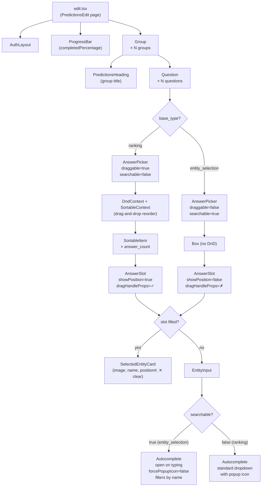

# Predictions Edit Page — Component Architecture

## Component Tree

## Question Type Paths

| Question type | Drag & drop | Input style | Popup icon |
|---|---|---|---|
| `ranking` | Yes — via `SortableItem` + `DndContext` | Standard dropdown | Visible |
| `entity_selection` | No — plain `Box` | Type-to-search, opens on keystroke | Hidden (`forcePopupIcon=false`) |

## Key Files

| File | Role |
|---|---|
| `resources/js/pages/predictions/edit.tsx` | Page entry point; receives grouped questions & answers via Inertia props |
| `resources/js/components/Answering/Group.tsx` | Renders a labelled group of questions |
| `resources/js/components/Answering/Question.tsx` | Resolves `base_type` and passes config to `AnswerPicker` |
| `resources/js/components/Answering/AnswerPicker.tsx` | Manages selected entities state, API calls (add/delete/reorder), and renders slots |
| `resources/js/components/Answering/SortableItem.tsx` | Wraps `AnswerSlot` with `@dnd-kit/sortable` for ranking questions |
| `resources/js/components/Answering/AnswerSlot.tsx` | Single slot — shows `SelectedEntityCard` when filled, `EntityInput` when empty |
| `resources/js/components/Answering/SelectedEntityCard.tsx` | Displays a chosen entity with optional position number and a clear button |
| `resources/js/components/Answering/EntityInput.tsx` | MUI Autocomplete input — searchable (type-to-open) or standard dropdown |
